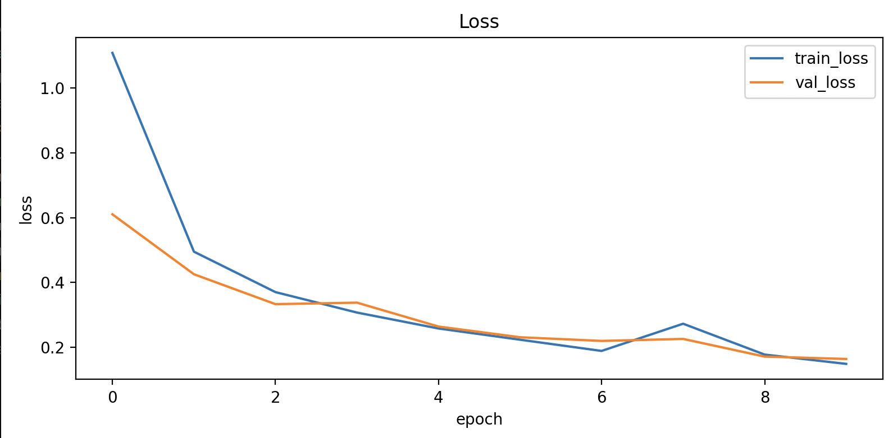
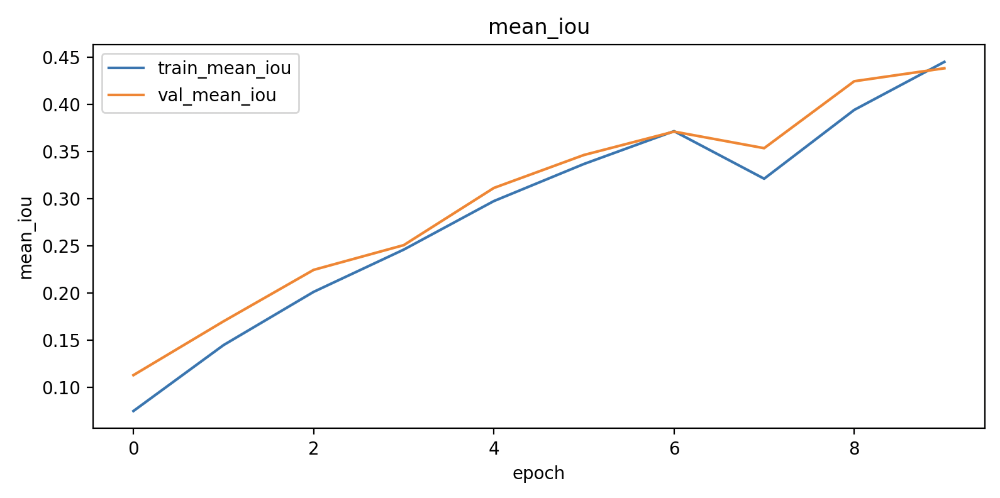
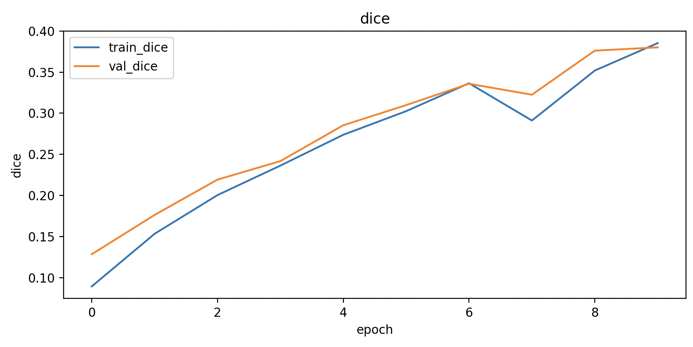
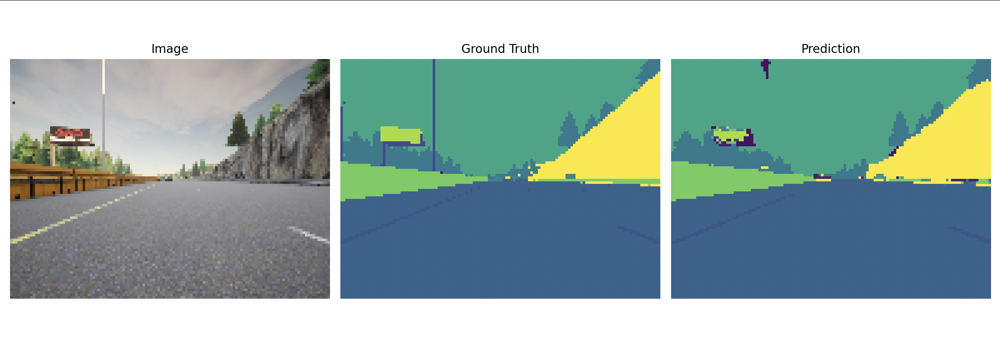
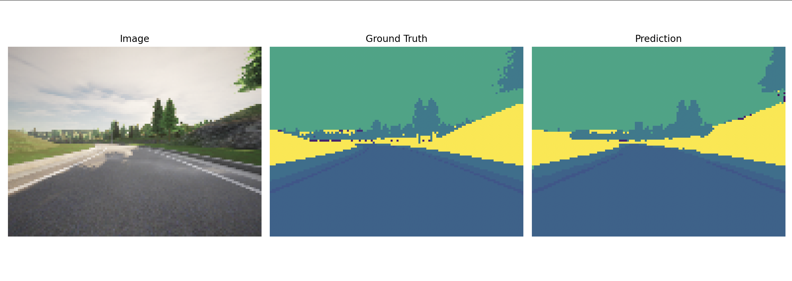

# Image Segmentation with U-Net (TensorFlow)

This repository contains a **semantic image segmentation** project implemented using **TensorFlow / Keras**, based on the **U-Net architecture**.

The project is adapted from Andrew Ng’s Deep Learning Specialization (U-Net lab), but implemented **locally using pure Python files** instead of Jupyter notebooks.  
The goal is to perform **pixel-wise classification**, predicting a class label for every pixel in an image from a self-driving car dataset.

---
This project focuses on understanding and implementing U-Net, not simply using a prebuilt model.

Implemented entirely with Python scripts for better version control and reproducibility.

Suitable as a learning project and as a foundation for more advanced segmentation tasks.

## 📌 Project Overview

- Load RGB images and corresponding segmentation masks
- Build a **U-Net model from scratch**
- Train using TensorFlow `tf.data` pipelines
- Evaluate performance using **IoU** and **Dice coefficient**
- Visualize predictions (image / ground truth / model output)

---

## 🧠 U-Net Architecture

U-Net consists of two symmetric paths:

### 🔽 Encoder (Contracting Path)
- Repeated blocks of:
  - `Conv2D → ReLU → Conv2D → ReLU`
  - `MaxPooling`
- Spatial resolution decreases
- Feature depth increases
- Captures **high-level semantic features**

### 🔼 Decoder (Expanding Path)
- `Conv2DTranspose` for upsampling
- Skip connections from encoder layers
- Concatenation of low-level and high-level features
- Restores spatial resolution for precise segmentation

Skip connections are crucial for preserving spatial details that would otherwise be lost during downsampling.

---

## 📊 Evaluation Metrics

### Intersection over Union (IoU)

IoU measures the overlap between prediction and ground truth:

IoU = Intersection / Union

- Very strict metric
- Sensitive to boundary errors
- Commonly used for segmentation benchmarks

---

### Dice Coefficient

Dice measures overlap similarly to IoU, but is smoother and more stable:

Dice = 2 × |Prediction ∩ Ground Truth| / (|Prediction| + |Ground Truth|)

- Ranges from **0 (no overlap)** to **1 (perfect overlap)**
- Handles class imbalance better than accuracy
- Especially useful for segmentation tasks

> For segmentation, **IoU and Dice are far more informative than accuracy**.

---

## 📈 Training Results

- Training and validation loss decrease consistently
- Mean IoU and Dice increase steadily
- No significant overfitting observed
- Model successfully learns large structures such as:
  - road
  - sky
  - buildings

Smaller objects (e.g. traffic signs, poles) are more difficult to segment due to:
- class imbalance
- limited input resolution
## 📊 Training Curves

### Loss


### Mean IoU


### Dice Coefficient


---

## 🔧 How to Improve IoU and Dice

Several techniques can further improve segmentation performance:

### 1️⃣ Use Dice Loss or Hybrid Loss
Instead of only Cross-Entropy:

Loss = CrossEntropy + DiceLoss

This improves learning for small or rare classes.

---

### 2️⃣ Increase Input Resolution
Current resolution:

96 × 128
Increasing to: 192 × 256

or higher allows the model to capture finer details.

---

### 3️⃣ Handle Class Imbalance
- Use class-weighted loss
- Or train a binary segmentation model (e.g. road vs background)

---

### 4️⃣ Train Longer with Learning Rate Scheduling
- More epochs
- `ReduceLROnPlateau`
- Early stopping to prevent overfitting

---


> Dataset files are intentionally excluded due to licensing restrictions.

---
## 🖼 Example Prediction

From left to right: **Input Image / Ground Truth / Model Prediction**





## 🚀 How to Run

```bash
python src/main.py

Requirements

Python 3.10+

TensorFlow

NumPy

Matplotlib


